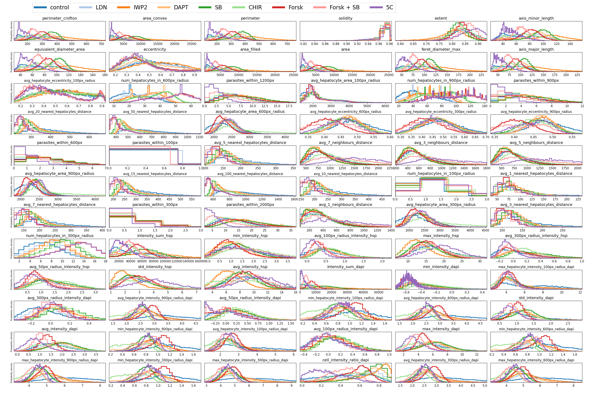

# LiverStagePipeline
This repository is intented to automate the analysis of microscopy fluorescence images of _in vitro_ models of liver-stage malaria. It provides the following functionalities:
1. Segmentation of parasites and hepatocyte nuclei present in the images. 
3. Extraction (and plotting) of features informative of parasite- and nucleus morphology. 
4. Training a variational autoencoder on the extracted features and assessing distances between experimental groups by calculating the _Silhouette coefficient_ within the latent space.
   

Examplary Jupyter notebooks are provided under _tutorials_. Segmentation models were trained on images containing the HSP70- and DAPI stainings at a resolution of 1392x1040.

### Installation
The recommended way to run this pipeline is by creating a Python 3.9 [Anaconda environment](https://conda.io/projects/conda/en/latest/user-guide/tasks/manage-environments.html) and installing the packages specified in requirements.txt.

Here follow a few exemplary images from running the pipeline on a dataset containing different drug treatments:

 

